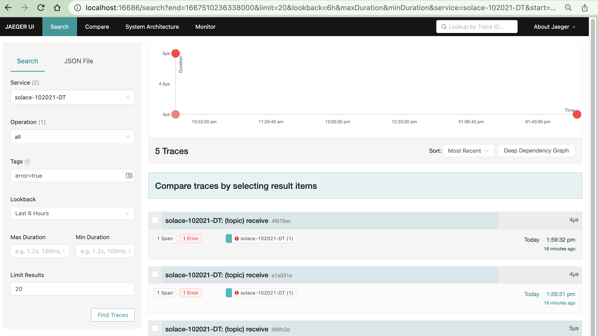

# Solace distributed tracing setup notes

nram, Solace PSG

## About

Steps to setup and runs all required components for testing / demoing distributed tracing.  All components are run as docker containers.

Components:

- Solace broker (10.2.0.21 or later)
- Open telemetry collector with solace receiver (otel-collector-contrib)
- Jaeger UI

## Solace Broker

Get SolOS 10.2.0.21 or later.

https://filedrop.solace.com/products/10.2-Preview/PubSub_Ent/Current/10.2.0.21/

``` sh
▶ docker start solace-10.2.0.21-DT
```

### Setting up telemetry profiles:

Run setup-dt.cli from CLI shell

``` sh
solace-102021-DT> source script setup-dt.cli stop-on-error no-prompt
```

``` sh
▶ cat jail/cliscripts/setup-dt.cli
home
enable
configure
message-vpn default
authentication basic auth-type internal
exit
client-username default message-vpn default
password default
exit
client-profile default message-vpn default
message-spool reject-msg-to-sender-on-no-subscription-match
end

configure
message-vpn default
create telemetry-profile trace
receiver acl connect default-action allow
no receiver shutdown
trace
no shutdown
create filter default
no shutdown
create subscription ">"
end

configure
create client-username trace message-vpn default
password trace
client-profile #telemetry-trace
acl-profile #telemetry-trace
no shutdown
end%
```

looks like this can be done via UI also


## Open telemetry Collector

### Using docker

``` sh
▶ docker pull otel/opentelemetry-collector-contrib
▶ docker run -v $PWD/otelcol:/etc/otelcol otel/opentelemetry-collector-contrib --config /etc/otelcol/docker-config.yaml
```

See [docker-config.yaml](otelcol/docker-config.yaml) that uses docker.for.mac.host.internal

### Running from shell

``` sh
▶ gh repo clone open-telemetry/opentelemetry-collector-contrib
▶ make install-tools
▶ make otelcontribcol
▶ bin/otelcontribcol_darwin_amd64 --config otel-collector-config.yaml
```
See [otel-collector-config.yaml](otelcol/otel-collector-config.yaml)

## Jaeger

``` sh
docker pull jaegertracing/all-in-one
docker run  jaegertracing/all-in-one
```

## Verify

``` sh
▶ docker ps
CONTAINER ID   IMAGE                                  COMMAND                  CREATED              STATUS              PORTS                                                                                                                                                                                                                                                                                   NAMES
59d34d0a6cec   jaegertracing/all-in-one               "/go/bin/all-in-one-…"   About a minute ago   Up About a minute   5775/udp, 5778/tcp, 14250/tcp, 14268/tcp, 6831-6832/udp, 16686/tcp                                                                                                                                                                                                                      upbeat_bose
11cec60c2957   otel/opentelemetry-collector-contrib   "/otelcol-contrib --…"   22 minutes ago       Up 22 minutes       4317/tcp, 55678-55679/tcp                                                                                                                                                                                                                                                               elastic_jackson
dc3663a43a1d   solace-pubsub-enterprise:10.2.0.21     "/usr/sbin/boot.sh"      25 hours ago         Up 3 hours          0.0.0.0:1883->1883/tcp, 0.0.0.0:2222->2222/tcp, 0.0.0.0:5672->5672/tcp, 0.0.0.0:8000->8000/tcp, 0.0.0.0:8008->8008/tcp, 0.0.0.0:8080->8080/tcp, 0.0.0.0:9000-9002->9000-9002/tcp, 0.0.0.0:55003->55003/tcp, 0.0.0.0:55443->55443/tcp, 0.0.0.0:943->1943/tcp, 0.0.0.0:55333->55555/tcp   solace-10.2.0.21-DT
```

Publish some msgs - some with no subscription to simulate error

``` sh
▶ ./sdkperf_jms.sh -cip localhost:55333 -cu default@default -cp default -ptl   test/1 -mn 3 # Success
▶ ./sdkperf_jms.sh -cip localhost:55333 -cu default@default -cp default -ptl x/test/1 -mn 2 # Fail
```

http://localhost:16686/search


